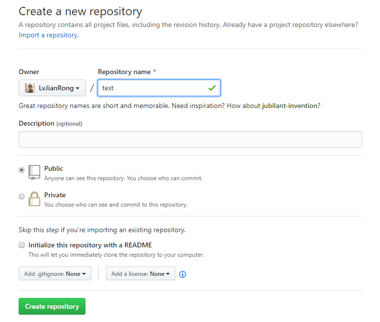
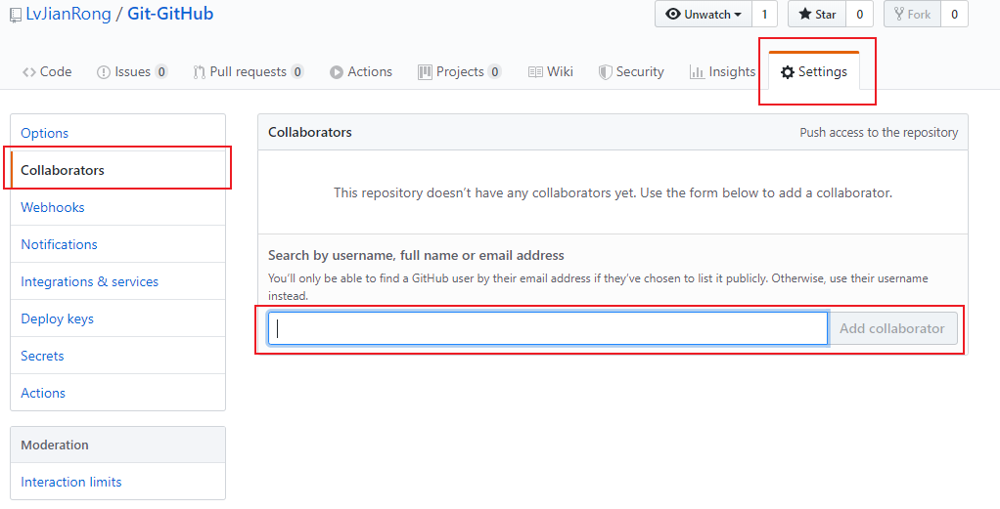
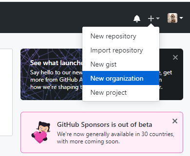
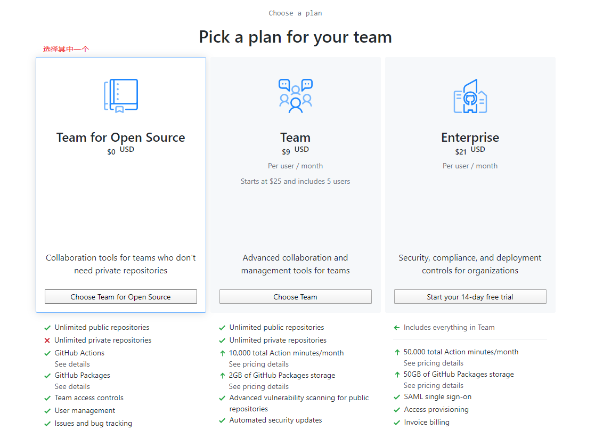
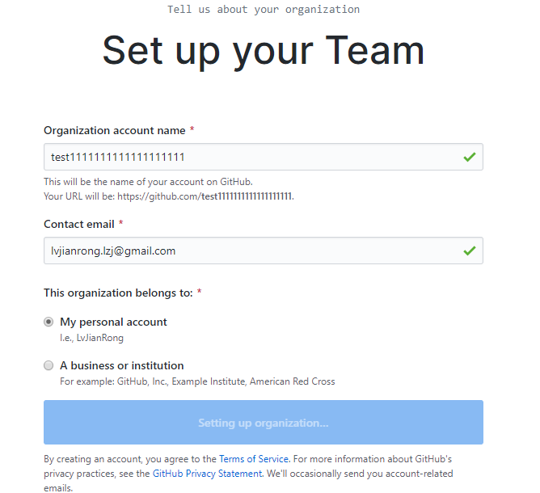
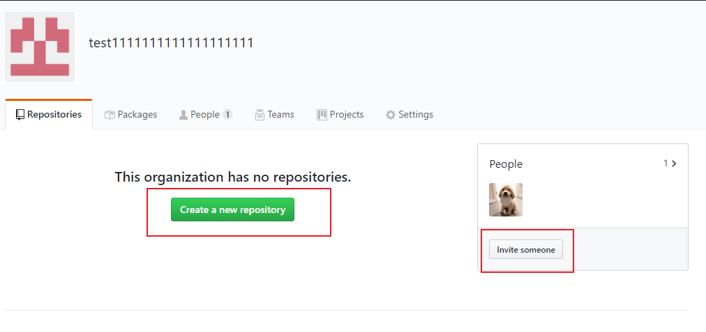

# 本地git版本管理
+ 文件夹git初始化，表示对当前文件夹进行版本控制  
    ```shell
    $ # cd到目标文件夹下 
    $ git init # 创建.git隐藏文件
    ```
+ 创建文件/项目
    ```shell
    $ touch 1.py
    ```
+ 查看git当前状态
    ```shell
    $ git status
    ```
+ 将指定文件添加到版本库的暂存状态
    ```shell
    $ git add filename
    ```
+ 将暂存区的文件提交到版本库的分支
    ```shell
    $ git commit -m 'description'
    ```
+ 第一次提交需要配置用户名和邮箱
    ```shell
    $ git config user.name xxx
    $ git config user.email xxx.com
    ```
+ 查看提交记录
    ```shell
    $ git log # 只能查看当前状态之前的记录
    $ git reflog # 可查看所有记录
    ```
+ 创建分支
    ```shell
    $ git branch dev # 创建dev分支
    ```
+ 切换分支
    ```shell
    $ git checkout dev # 切换到dev分支
    ```
+ 创建并切换到指定分支
    ```shell
    $ git branch -m branchname
    ```
+ 查看所有分支
    ```shell
    $ git branch
    ```
+ 删除分支
    ```shell
    $ git branch -d branchname
    ```
+ 将指定分支合并到当前分支
    ```shell
    $ git merge branchname
    ```

-----------
# GitHub使用
+ 注册GitHub账号
+ 创建GitHub仓库
    
+ 为仓库网址起一个别名origin
    ```shell
    $ git remote add origin https://github.com/LvJianRong/Git-GitHub.git
    ```
+ 将本地master的文件推送到GitHub上
    ```shell
    $ git push origin master
    ```
+ 在其他电脑将GitHub的仓库拉下来
    - 方法一：克隆
        ```shell
        $ git clone https://github.com/LvJianRong/Git-GitHub.git
        ```
        该方法拉下来的文件不需要进行`git init`操作，因为已经包含了`.git`文件
    - 方法二：pull
        ```shell
        $ git pull origin master 
        ```
    第一次把仓库拉下来通过方法一：克隆，之后用方法二：pull，这样就省去了之前的用户名配置等操作
-------
# 协同开发
+ 通过***合作者***的方式  
    
+ 通过***组织***的方式  
    
    
    
    
